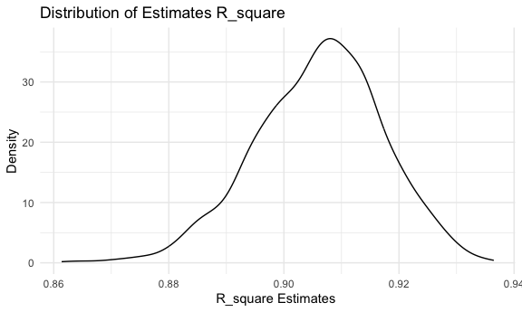

HW_6
================
Amy Liu
2023-11-29

## Problem 1

- Create a city_state variable (e.g. “Baltimore, MD”), and a binary
  variable indicating whether the homicide is solved. Omit cities
  Dallas, TX; Phoenix, AZ; and Kansas City, MO – these don’t report
  victim race. Also omit Tulsa, AL – this is a data entry mistake. For
  this problem, limit your analysis those for whom victim_race is white
  or black. Be sure that victim_age is numeric.

``` r
homicide_df = 
  read_csv("./homicide-data.csv", na = c("", "NA", "Unknown")) %>% 
  mutate(city_state = str_c(city, state, sep = ", ")) %>% 
  mutate(solved = ifelse(disposition == "Closed by arrest",1,0)) %>% 
  mutate(victim_age = as.numeric(victim_age)) %>% 
  filter(!city_state %in% c("Dallas, TX", "Phoenix, AZ", "Kansas City, MO","Tulsa, AL"), 
         (victim_race %in% c("White", "Black")))
```

    ## Rows: 52179 Columns: 12
    ## ── Column specification ────────────────────────────────────────────────────────
    ## Delimiter: ","
    ## chr (8): uid, victim_last, victim_first, victim_race, victim_sex, city, stat...
    ## dbl (4): reported_date, victim_age, lat, lon
    ## 
    ## ℹ Use `spec()` to retrieve the full column specification for this data.
    ## ℹ Specify the column types or set `show_col_types = FALSE` to quiet this message.

- For the city of Baltimore, MD, use the glm function to fit a logistic
  regression with resolved vs unresolved as the outcome and victim age,
  sex and race as predictors. Save the output of glm as an R object;
  apply the broom::tidy to this object; and obtain the estimate and
  confidence interval of the adjusted odds ratio for solving homicides
  comparing male victims to female victims keeping all other variables
  fixed.

``` r
baltimore = 
  homicide_df %>% 
  filter(city == "Baltimore") %>% 
  mutate(victim_sex = as.factor(victim_sex),
         victim_race = as.factor(victim_race),
         solved = factor(solved, levels = c(0, 1)))

baltimore_logit_model = 
  glm(solved ~ victim_age + victim_race + victim_sex,
      data = baltimore, 
      family = binomial())

baltimore_model=
  baltimore_logit_model %>% 
  broom::tidy() %>% 
  knitr::kable(digits = 3)

baltimore_model
```

| term             | estimate | std.error | statistic | p.value |
|:-----------------|---------:|----------:|----------:|--------:|
| (Intercept)      |    0.310 |     0.171 |     1.810 |   0.070 |
| victim_age       |   -0.007 |     0.003 |    -2.024 |   0.043 |
| victim_raceWhite |    0.842 |     0.175 |     4.818 |   0.000 |
| victim_sexMale   |   -0.854 |     0.138 |    -6.184 |   0.000 |

``` r
save(baltimore_model, file = "./baltimore_logit_model")

odd_ratio = baltimore_logit_model %>% 
  broom::tidy() %>% 
  filter(term == 'victim_sexMale') %>% 
  summarise(estimate = estimate,
            odd_ratio = exp(estimate),
            odd_ratio_lower = exp(estimate - 1.96 * std.error),
            odd_ratio_upper = exp(estimate + 1.96 * std.error)
         ) %>% 
  knitr::kable(digits = 3)

odd_ratio
```

| estimate | odd_ratio | odd_ratio_lower | odd_ratio_upper |
|---------:|----------:|----------------:|----------------:|
|   -0.854 |     0.426 |           0.325 |           0.558 |

- Run glm for each of the cities in your dataset, and extract the
  adjusted odds ratio (and CI) for solving homicides comparing male
  victims to female victims

``` r
logit_model= 
  homicide_df %>% 
  nest(data = -city_state) %>% 
  mutate(
    logit_model = map(.x = data, ~glm(solved ~ victim_age + victim_race + victim_sex, data = .x, family = binomial())),
    logit_results = map(logit_model, broom::tidy)
    ) %>%
  select(city_state, logit_results) %>% 
  unnest(logit_results) %>% 
  mutate(
    OR = exp(estimate),
    CI_lower = exp(estimate - 1.96 * std.error),
    CI_upper = exp(estimate + 1.96 * std.error))

logit_model
```

    ## # A tibble: 188 × 9
    ##    city_state term  estimate std.error statistic p.value    OR CI_lower CI_upper
    ##    <chr>      <chr>    <dbl>     <dbl>     <dbl>   <dbl> <dbl>    <dbl>    <dbl>
    ##  1 Albuquerq… (Int…  6.12e-1   0.632    0.969    3.33e-1 1.84     0.534    6.37 
    ##  2 Albuquerq… vict… -1.97e-2   0.00909 -2.16     3.04e-2 0.981    0.963    0.998
    ##  3 Albuquerq… vict…  4.12e-1   0.416    0.990    3.22e-1 1.51     0.668    3.41 
    ##  4 Albuquerq… vict…  5.70e-1   0.385    1.48     1.39e-1 1.77     0.831    3.76 
    ##  5 Atlanta, … (Int…  8.69e-1   0.242    3.60     3.21e-4 2.39     1.49     3.83 
    ##  6 Atlanta, … vict… -1.16e-2   0.00466 -2.50     1.24e-2 0.988    0.979    0.997
    ##  7 Atlanta, … vict…  2.69e-1   0.284    0.945    3.45e-1 1.31     0.749    2.28 
    ##  8 Atlanta, … vict…  7.71e-5   0.194    0.000397 1.00e+0 1.00     0.684    1.46 
    ##  9 Baltimore… (Int…  3.10e-1   0.171    1.81     7.04e-2 1.36     0.975    1.91 
    ## 10 Baltimore… vict… -6.73e-3   0.00332 -2.02     4.30e-2 0.993    0.987    1.00 
    ## # ℹ 178 more rows

- Create a plot that shows the estimated ORs and CIs for each city.
  Organize cities according to estimated OR, and comment on the plot.

``` r
logit_model %>% 
  filter(term == "victim_sexMale") %>% 
  mutate(city_state = fct_reorder(city_state, OR)) %>% 
  ggplot(aes(x = city_state, y = OR)) +
  geom_point() + 
  geom_errorbar(aes(ymin = CI_lower, ymax = CI_upper)) + 
  theme(axis.text.x = element_text(angle = 90, vjust = 0.5, hjust = 1))
```


## Problem 2

- Use 5000 bootstrap samples and, for each bootstrap sample, produce
  estimates of these two quantities. Plot the distribution of your
  estimates, and describe these in words. Using the 5000 bootstrap
  estimates, identify the 2.5% and 97.5% quantiles to provide a 95%
  confidence interval for r2 and log(β̂ 0∗β̂2)

``` r
# load data
weather_df = 
  rnoaa::meteo_pull_monitors(
    c("USW00094728"),
    var = c("PRCP", "TMIN", "TMAX"), 
    date_min = "2022-01-01",
    date_max = "2022-12-31") |>
  mutate(
    name = recode(id, USW00094728 = "CentralPark_NY"),
    tmin = tmin / 10,
    tmax = tmax / 10) |>
  select(name, id, everything())
```

    ## using cached file: /Users/zhiqiliu/Library/Caches/org.R-project.R/R/rnoaa/noaa_ghcnd/USW00094728.dly

    ## date created (size, mb): 2023-11-29 21:02:10.152205 (8.544)

    ## file min/max dates: 1869-01-01 / 2023-11-30

``` r
# Bootstrap analysis

bootstrap_estimates=
  weather_df %>% 
  modelr::bootstrap(n = 5000) %>% 
  mutate(
    weather_linear = map(strap, ~lm(tmax ~ tmin +prcp, data = .x)),
    weather_tidy= map(weather_linear, broom::tidy),
    weather_glance = map(weather_linear, broom::glance))%>%
  unnest(weather_tidy,weather_glance) %>% 
  select(term, estimate, r.squared) %>% 
  pivot_wider(names_from = term, values_from = estimate)%>%
  rename(
    beta_0 = `(Intercept)`,
    beta_1 = tmin,
    beta_2 = prcp)
```

    ## Warning: `unnest()` has a new interface. See `?unnest` for details.
    ## ℹ Try `df %>% unnest(c(weather_tidy, weather_glance))`, with `mutate()` if
    ##   needed.

``` r
result_bootstrap = 
  bootstrap_estimates %>% 
  mutate(r.squared = r.squared,
         log_beta1_2 = log(beta_1 * beta_2)) %>%
  na.omit()
```

    ## Warning: There was 1 warning in `mutate()`.
    ## ℹ In argument: `log_beta1_2 = log(beta_1 * beta_2)`.
    ## Caused by warning in `log()`:
    ## ! NaNs produced

``` r
head(result_bootstrap)
```

    ## # A tibble: 6 × 5
    ##   r.squared beta_0 beta_1   beta_2 log_beta1_2
    ##       <dbl>  <dbl>  <dbl>    <dbl>       <dbl>
    ## 1     0.918   7.99  1.02  0.00220        -6.10
    ## 2     0.912   8.18  0.988 0.00138        -6.60
    ## 3     0.914   7.99  1.01  0.000103       -9.17
    ## 4     0.880   8.27  0.976 0.0119         -4.45
    ## 5     0.910   8.15  0.995 0.00322        -5.74
    ## 6     0.905   7.84  1.01  0.00324        -5.73

#### Plot the distribution of estimates

- Plot the distribution of R_squared

``` r
result_bootstrap %>% 
  ggplot(aes(x = r.squared)) + 
  geom_density() +
  labs(
    title = "Distribution of Estimates R_square",
    x = "R_square Estimates ",
    y = "Density")
```



The distribution of r.squared is approximately normal with r.squared
value about 0.92. Since r.squrred valus is close to 1, there is a strong
linear relationship between maximum temperature and minimum temperature
and precipitation as explanatory variables. Thereofore, using minimum
temperature and precipitation can predict the maximum temperature well.

- Plot the distribution of log(beta_1 \* beta_2)

``` r
result_bootstrap %>% 
  ggplot(aes(x = log_beta1_2)) + 
  geom_density() +
  labs(
    title = "Distribution of Estimates log(beta_1 * beta_2",
    x = "log(beta_1 * beta_2) Estimates ",
    y = "Density")
```


The distribution of log(beta_1 \* beta_2)d is left-skewed with
log(beta_1 \* beta_2) value about -5.5.

- Using the 5000 bootstrap estimates, identify the 2.5% and 97.5%
  quantiles to provide a 95% confidence interval for r2 and log(β̂ 0∗β̂

``` r
r_squared_CI = 
  quantile(pull(result_bootstrap, r.squared),
           probs = c(0.025,0.975)) %>%
  knitr::kable(digits = 3, col.names = "r.squared")

r_squared_CI
```

|       | r.squared |
|:------|----------:|
| 2.5%  |     0.883 |
| 97.5% |     0.926 |

``` r
logbeta_1_2_CI = 
  quantile(pull(result_bootstrap, log_beta1_2),
           probs = c(0.025,0.975)) %>%
  knitr::kable(digits = 3, col.names = "log(beta1*beta2)")

logbeta_1_2_CI
```

|       | log(beta1\*beta2) |
|:------|------------------:|
| 2.5%  |            -9.106 |
| 97.5% |            -4.552 |

## Problem 3

- Load and clean data

``` r
birthweight = 
  read.csv("./birthweight.csv") %>% 
  janitor::clean_names() %>% 
  mutate(
    babysex = as.factor(case_match(babysex, 
                                   1 ~ "Male",
                                   2 ~"Female")),
    frace = as.factor(case_match(frace,
                                 1 ~ "White",
                                 2 ~ "Black",
                                 3 ~ "Asian",
                                 4 ~ "Puerto Rican",
                                 8 ~ "Other",
                                 9 ~ "Unknown")),
    malform = as.factor(case_match(malform,
                                   0 ~ "Absent",
                                   1 ~ "Present")),
    mrace = as.factor(case_match(mrace,
                                 1 ~ "White",
                                 2 ~ "Black",
                                 3 ~ "Asian",
                                 4 ~ "Puerto Rican",
                                 8 ~ "Other",
                                 9 ~ "Unknown")))

head(birthweight)
```

    ##   babysex bhead blength  bwt delwt fincome frace gaweeks malform menarche
    ## 1  Female    34      51 3629   177      35 White    39.9  Absent       13
    ## 2    Male    34      48 3062   156      65 Black    25.9  Absent       14
    ## 3  Female    36      50 3345   148      85 White    39.9  Absent       12
    ## 4    Male    34      52 3062   157      55 White    40.0  Absent       14
    ## 5  Female    34      52 3374   156       5 White    41.6  Absent       13
    ## 6    Male    33      52 3374   129      55 White    40.7  Absent       12
    ##   mheight momage mrace parity pnumlbw pnumsga    ppbmi ppwt smoken wtgain
    ## 1      63     36 White      3       0       0 26.27184  148      0     29
    ## 2      65     25 Black      0       0       0 21.34485  128      0     28
    ## 3      64     29 White      0       0       0 23.56517  137      1     11
    ## 4      64     18 White      0       0       0 21.84508  127     10     30
    ## 5      66     20 White      0       0       0 21.02642  130      1     26
    ## 6      66     23 White      0       0       0 18.60030  115      0     14

- check for missing data

``` r
missing_data=
  sapply(birthweight, function(x) sum(is.na(x)))
missing_data
```

    ##  babysex    bhead  blength      bwt    delwt  fincome    frace  gaweeks 
    ##        0        0        0        0        0        0        0        0 
    ##  malform menarche  mheight   momage    mrace   parity  pnumlbw  pnumsga 
    ##        0        0        0        0        0        0        0        0 
    ##    ppbmi     ppwt   smoken   wtgain 
    ##        0        0        0        0

There is no missing data.

``` r
skimr::skim(birthweight)
```

|                                                  |             |
|:-------------------------------------------------|:------------|
| Name                                             | birthweight |
| Number of rows                                   | 4342        |
| Number of columns                                | 20          |
| \_\_\_\_\_\_\_\_\_\_\_\_\_\_\_\_\_\_\_\_\_\_\_   |             |
| Column type frequency:                           |             |
| factor                                           | 4           |
| numeric                                          | 16          |
| \_\_\_\_\_\_\_\_\_\_\_\_\_\_\_\_\_\_\_\_\_\_\_\_ |             |
| Group variables                                  | None        |

Data summary

**Variable type: factor**

| skim_variable | n_missing | complete_rate | ordered | n_unique | top_counts                              |
|:--------------|----------:|--------------:|:--------|---------:|:----------------------------------------|
| babysex       |         0 |             1 | FALSE   |        2 | Mal: 2230, Fem: 2112                    |
| frace         |         0 |             1 | FALSE   |        5 | Whi: 2123, Bla: 1911, Pue: 248, Asi: 46 |
| malform       |         0 |             1 | FALSE   |        2 | Abs: 4327, Pre: 15                      |
| mrace         |         0 |             1 | FALSE   |        4 | Whi: 2147, Bla: 1909, Pue: 243, Asi: 43 |

**Variable type: numeric**

| skim_variable | n_missing | complete_rate |    mean |     sd |     p0 |     p25 |     p50 |     p75 |   p100 | hist  |
|:--------------|----------:|--------------:|--------:|-------:|-------:|--------:|--------:|--------:|-------:|:------|
| bhead         |         0 |             1 |   33.65 |   1.62 |  21.00 |   33.00 |   34.00 |   35.00 |   41.0 | ▁▁▆▇▁ |
| blength       |         0 |             1 |   49.75 |   2.72 |  20.00 |   48.00 |   50.00 |   51.00 |   63.0 | ▁▁▁▇▁ |
| bwt           |         0 |             1 | 3114.40 | 512.15 | 595.00 | 2807.00 | 3132.50 | 3459.00 | 4791.0 | ▁▁▇▇▁ |
| delwt         |         0 |             1 |  145.57 |  22.21 |  86.00 |  131.00 |  143.00 |  157.00 |  334.0 | ▅▇▁▁▁ |
| fincome       |         0 |             1 |   44.11 |  25.98 |   0.00 |   25.00 |   35.00 |   65.00 |   96.0 | ▃▇▅▂▃ |
| gaweeks       |         0 |             1 |   39.43 |   3.15 |  17.70 |   38.30 |   39.90 |   41.10 |   51.3 | ▁▁▂▇▁ |
| menarche      |         0 |             1 |   12.51 |   1.48 |   0.00 |   12.00 |   12.00 |   13.00 |   19.0 | ▁▁▂▇▁ |
| mheight       |         0 |             1 |   63.49 |   2.66 |  48.00 |   62.00 |   63.00 |   65.00 |   77.0 | ▁▁▇▂▁ |
| momage        |         0 |             1 |   20.30 |   3.88 |  12.00 |   18.00 |   20.00 |   22.00 |   44.0 | ▅▇▂▁▁ |
| parity        |         0 |             1 |    0.00 |   0.10 |   0.00 |    0.00 |    0.00 |    0.00 |    6.0 | ▇▁▁▁▁ |
| pnumlbw       |         0 |             1 |    0.00 |   0.00 |   0.00 |    0.00 |    0.00 |    0.00 |    0.0 | ▁▁▇▁▁ |
| pnumsga       |         0 |             1 |    0.00 |   0.00 |   0.00 |    0.00 |    0.00 |    0.00 |    0.0 | ▁▁▇▁▁ |
| ppbmi         |         0 |             1 |   21.57 |   3.18 |  13.07 |   19.53 |   21.03 |   22.91 |   46.1 | ▃▇▁▁▁ |
| ppwt          |         0 |             1 |  123.49 |  20.16 |  70.00 |  110.00 |  120.00 |  134.00 |  287.0 | ▅▇▁▁▁ |
| smoken        |         0 |             1 |    4.15 |   7.41 |   0.00 |    0.00 |    0.00 |    5.00 |   60.0 | ▇▁▁▁▁ |
| wtgain        |         0 |             1 |   22.08 |  10.94 | -46.00 |   15.00 |   22.00 |   28.00 |   89.0 | ▁▁▇▁▁ |

- Propose a regression model for birthweight. This model may be based on
  a hypothesized structure for the factors that underly birthweight, on
  a data-driven model-building process, or a combination of the two.
  Describe your modeling process and show a plot of model residuals
  against fitted values – use add_predictions and add_residuals in
  making this plot.

- full model

``` r
model_full=
  lm(bwt ~ ., data = birthweight)

summary(model_full)
```

    ## 
    ## Call:
    ## lm(formula = bwt ~ ., data = birthweight)
    ## 
    ## Residuals:
    ##      Min       1Q   Median       3Q      Max 
    ## -1097.68  -184.86    -3.33   173.09  2344.15 
    ## 
    ## Coefficients: (3 not defined because of singularities)
    ##                     Estimate Std. Error t value Pr(>|t|)    
    ## (Intercept)       -6306.8346   659.2640  -9.566  < 2e-16 ***
    ## babysexMale         -28.7073     8.4652  -3.391 0.000702 ***
    ## bhead               130.7781     3.4523  37.881  < 2e-16 ***
    ## blength              74.9536     2.0217  37.075  < 2e-16 ***
    ## delwt                 4.1007     0.3948  10.386  < 2e-16 ***
    ## fincome               0.2898     0.1795   1.614 0.106551    
    ## fraceBlack           -6.9048    78.8349  -0.088 0.930210    
    ## fraceOther          -16.9392    97.5932  -0.174 0.862212    
    ## fracePuerto Rican   -68.2323    78.4692  -0.870 0.384599    
    ## fraceWhite          -21.2361    69.2960  -0.306 0.759273    
    ## gaweeks              11.5494     1.4654   7.882 4.06e-15 ***
    ## malformPresent        9.7650    70.6259   0.138 0.890039    
    ## menarche             -3.5508     2.8951  -1.226 0.220083    
    ## mheight               9.7874    10.3116   0.949 0.342588    
    ## momage                0.7593     1.2221   0.621 0.534418    
    ## mraceBlack          -60.0488    80.9532  -0.742 0.458266    
    ## mracePuerto Rican    34.9079    80.9481   0.431 0.666317    
    ## mraceWhite           91.3866    71.9190   1.271 0.203908    
    ## parity               95.5411    40.4793   2.360 0.018307 *  
    ## pnumlbw                   NA         NA      NA       NA    
    ## pnumsga                   NA         NA      NA       NA    
    ## ppbmi                 4.3538    14.8913   0.292 0.770017    
    ## ppwt                 -3.4716     2.6121  -1.329 0.183913    
    ## smoken               -4.8544     0.5871  -8.269  < 2e-16 ***
    ## wtgain                    NA         NA      NA       NA    
    ## ---
    ## Signif. codes:  0 '***' 0.001 '**' 0.01 '*' 0.05 '.' 0.1 ' ' 1
    ## 
    ## Residual standard error: 272.5 on 4320 degrees of freedom
    ## Multiple R-squared:  0.7183, Adjusted R-squared:  0.717 
    ## F-statistic: 524.6 on 21 and 4320 DF,  p-value: < 2.2e-16

``` r
model_full %>%  
  broom::tidy() %>% 
  knitr::kable(digits = 3)
```

| term              |  estimate | std.error | statistic | p.value |
|:------------------|----------:|----------:|----------:|--------:|
| (Intercept)       | -6306.835 |   659.264 |    -9.566 |   0.000 |
| babysexMale       |   -28.707 |     8.465 |    -3.391 |   0.001 |
| bhead             |   130.778 |     3.452 |    37.881 |   0.000 |
| blength           |    74.954 |     2.022 |    37.075 |   0.000 |
| delwt             |     4.101 |     0.395 |    10.386 |   0.000 |
| fincome           |     0.290 |     0.180 |     1.614 |   0.107 |
| fraceBlack        |    -6.905 |    78.835 |    -0.088 |   0.930 |
| fraceOther        |   -16.939 |    97.593 |    -0.174 |   0.862 |
| fracePuerto Rican |   -68.232 |    78.469 |    -0.870 |   0.385 |
| fraceWhite        |   -21.236 |    69.296 |    -0.306 |   0.759 |
| gaweeks           |    11.549 |     1.465 |     7.882 |   0.000 |
| malformPresent    |     9.765 |    70.626 |     0.138 |   0.890 |
| menarche          |    -3.551 |     2.895 |    -1.226 |   0.220 |
| mheight           |     9.787 |    10.312 |     0.949 |   0.343 |
| momage            |     0.759 |     1.222 |     0.621 |   0.534 |
| mraceBlack        |   -60.049 |    80.953 |    -0.742 |   0.458 |
| mracePuerto Rican |    34.908 |    80.948 |     0.431 |   0.666 |
| mraceWhite        |    91.387 |    71.919 |     1.271 |   0.204 |
| parity            |    95.541 |    40.479 |     2.360 |   0.018 |
| pnumlbw           |        NA |        NA |        NA |      NA |
| pnumsga           |        NA |        NA |        NA |      NA |
| ppbmi             |     4.354 |    14.891 |     0.292 |   0.770 |
| ppwt              |    -3.472 |     2.612 |    -1.329 |   0.184 |
| smoken            |    -4.854 |     0.587 |    -8.269 |   0.000 |
| wtgain            |        NA |        NA |        NA |      NA |

- proposed model

``` r
model_chose=
  lm(bwt ~ bhead + blength + delwt + gaweeks + smoken, data = birthweight)

summary(model_chose)
```

    ## 
    ## Call:
    ## lm(formula = bwt ~ bhead + blength + delwt + gaweeks + smoken, 
    ##     data = birthweight)
    ## 
    ## Residuals:
    ##      Min       1Q   Median       3Q      Max 
    ## -1165.34  -185.08    -9.88   175.80  2490.16 
    ## 
    ## Coefficients:
    ##               Estimate Std. Error t value Pr(>|t|)    
    ## (Intercept) -6222.7260    95.4628 -65.185  < 2e-16 ***
    ## bhead         135.3264     3.4987  38.679  < 2e-16 ***
    ## blength        78.6666     2.0742  37.926  < 2e-16 ***
    ## delwt           2.0911     0.1996  10.478  < 2e-16 ***
    ## gaweeks        14.5726     1.4926   9.763  < 2e-16 ***
    ## smoken         -2.2631     0.5824  -3.886 0.000104 ***
    ## ---
    ## Signif. codes:  0 '***' 0.001 '**' 0.01 '*' 0.05 '.' 0.1 ' ' 1
    ## 
    ## Residual standard error: 282.3 on 4336 degrees of freedom
    ## Multiple R-squared:  0.6965, Adjusted R-squared:  0.6961 
    ## F-statistic:  1990 on 5 and 4336 DF,  p-value: < 2.2e-16

``` r
model_chose %>%  
  broom::tidy() %>% 
  knitr::kable(digits = 3)
```

| term        |  estimate | std.error | statistic | p.value |
|:------------|----------:|----------:|----------:|--------:|
| (Intercept) | -6222.726 |    95.463 |   -65.185 |       0 |
| bhead       |   135.326 |     3.499 |    38.679 |       0 |
| blength     |    78.667 |     2.074 |    37.926 |       0 |
| delwt       |     2.091 |     0.200 |    10.478 |       0 |
| gaweeks     |    14.573 |     1.493 |     9.763 |       0 |
| smoken      |    -2.263 |     0.582 |    -3.886 |       0 |

For proposing a liner model for birthweight, I will use variables bhead,
blength, delwt, gaweeks, and smoken to fit a model because of their
statistically significant predictors based on their p-values.

- plot of model residuals against fitted values

``` r
birthweight %>% 
    add_predictions(model_chose) %>% 
    add_residuals(model_chose) %>% 
    ggplot(aes(x = pred, y = resid)) +
    geom_point()  + 
    geom_smooth(method = "lm") + 
    labs(title = "Residuals vs Fitted Values", 
       x = "Fitted Values", 
       y = "Residuals")
```

    ## `geom_smooth()` using formula = 'y ~ x'


From the plot, the residuals are spread around the line at zero,
indicating linearity and homoscedasticity according to the model
prediction. However, some data points are mot predicted well with this
model.

- Compare your model to two others: One using length at birth and
  gestational age as predictors (main effects only) One using head
  circumference, length, sex, and all interactions (including the
  three-way interaction) between these

``` r
model_1 = 
  lm(bwt ~ blength + gaweeks, data = birthweight)

model_1 %>% 
  broom::tidy() %>% 
  knitr::kable(digits = 3)
```

| term        |  estimate | std.error | statistic | p.value |
|:------------|----------:|----------:|----------:|--------:|
| (Intercept) | -4347.667 |    97.958 |   -44.383 |       0 |
| blength     |   128.556 |     1.990 |    64.604 |       0 |
| gaweeks     |    27.047 |     1.718 |    15.744 |       0 |

``` r
model_2 = 
  lm(bwt ~ bhead * blength * babysex, data = birthweight)

model_2 %>% 
  broom::tidy() %>% 
  knitr::kable(digits = 3)
```

| term                      |  estimate | std.error | statistic | p.value |
|:--------------------------|----------:|----------:|----------:|--------:|
| (Intercept)               |  -801.949 |  1102.308 |    -0.728 |   0.467 |
| bhead                     |   -16.598 |    34.092 |    -0.487 |   0.626 |
| blength                   |   -21.646 |    23.372 |    -0.926 |   0.354 |
| babysexMale               | -6374.868 |  1677.767 |    -3.800 |   0.000 |
| bhead:blength             |     3.324 |     0.713 |     4.666 |   0.000 |
| bhead:babysexMale         |   198.393 |    51.092 |     3.883 |   0.000 |
| blength:babysexMale       |   123.773 |    35.119 |     3.524 |   0.000 |
| bhead:blength:babysexMale |    -3.878 |     1.057 |    -3.670 |   0.000 |

- Make this comparison in terms of the cross-validated prediction error;
  use crossv_mc and functions in purrr as appropriate.

``` r
cv_data = 
  birthweight %>% 
  crossv_mc(n = 100)

cv_df =
  cv_data %>% 
  mutate(
    train = map(train, as_tibble),
    test = map(test, as_tibble)) %>% 
  mutate(
    model_propose = map(train, ~model_chose),
    mode_1= map(train, ~model_1),
    mode_2= map(train, ~model_2)) %>% 
  mutate(
    rmse_propose = map2_dbl(model_propose, test, ~rmse(model = .x, data = .y)),
    rmse_option1 = map2_dbl(mode_1, test, ~rmse(model = .x, data = .y)),
    rmse_option2 = map2_dbl(mode_2, test,~rmse(model = .x, data = .y)))
```

- Fit the Root Mean Squared Error for three models

``` r
cv_df %>% 
  select(starts_with("rmse")) %>% 
  pivot_longer(
    everything(),
    names_to = "model", 
    values_to = "rmse",
    names_prefix = "rmse_") %>% 
  mutate(model = fct_inorder(model)) %>% 
  ggplot(aes(x = model, y = rmse)) + 
  geom_boxplot() +
  labs(title = "Prediction Error Distributions across Models", x = "Models", y = "Root Mean Square Error")  +
  scale_x_discrete(labels = c("My Model", "Length + Gestational Age", "Interactions Model")) +
  theme(plot.title = element_text(hjust = 0.5, face = "bold"))
```


After comparing models based on the cross-validated prediction error,
the root mean squared error is the smallest for my proposed model.
Therefore, model includes variables bhead, blength, delwt, gaweeks, and
smoken to fit the data the best among these three models.
